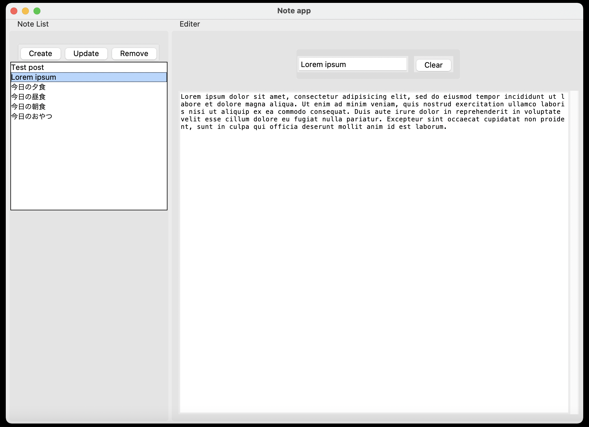

# tkinter-note-app

This is a GUI notebook application for tkinter created for learning.

## Screenshot



## Python version etc...

```sh
python --version
# => Python 3.10.1

python -c "import tkinter;print(tkinter.TkVersion)"
# => 8.6
```

## Start GUI App

```sh
python main
```